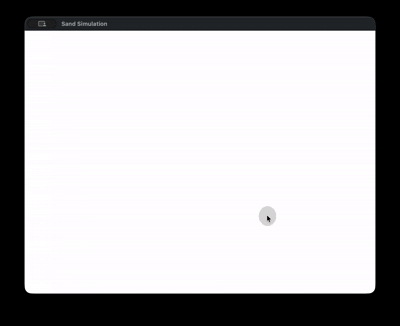

# Sand simulation

A falling-sand style particle simulation written in Rust, using `winit` for windowing/input and `wgpu` for GPU rendering.



## How it works

The world is a 600x400 grid stored as a flat `Vec<u8>`, one byte per cell (`0 = air`, `1 = sand`, `2 = stone`). About 60 times per second the grid is updated in place, sweeping bottom-to-top so particles can fall within a single pass:

- **Sand** falls straight down if the cell below is empty; otherwise it tries down-right, then down-left — the classic falling-sand diagonal slide.
- **Stone** only falls straight down if the cell below is empty; it never slides diagonally, so it behaves like a heavier, static solid.

After each update, the grid is uploaded to a GPU storage buffer and a fragment shader colors each pixel according to its material.

## Controls

- **Left mouse button**: paint the selected material in a brush around the cursor.
- **Arrow Up / Right**: cycle the selected material forward (air → sand → stone → air).
- **Arrow Down / Left**: cycle the selected material backward.

## Running

```
cargo run
```
